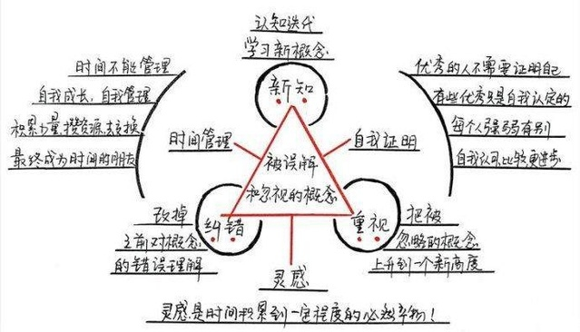

#[把时间当朋友](https://book.douban.com/subject/3609132/)
作者: 李笑来
出版社: 电子工业出版社
副标题: 运用心智获得解放
出版年: 2009-06
***
### 内容简介 
这本书从心智成长的角度来谈时间管理，指出时间管理是成功的关键所在。作者引述自己从事的职业中所遇到的事例，告诉我们：如何打开心智，如何运用心智来和时间做朋友，如何理解时间管理的意义，在时间管理上取得突破，进而用心智开启自己的人生成功之旅。

### 作者简介 
李笑来，原新东方老师，现笑来教育信息咨询有限公司合伙人。他，经历丰富，与众不同。东北人，本科学财会，毕业干销售，惯于洞察他人心理，阴差阳错成了留学考试名师，授业解惑，乐此不疲。

他写书，且畅销。著有畅销书《TOEFL核心词汇21天突破》、《TOEFL高分作文》——常年位于同类图书销售排行榜首。授课风格以朴实、有效见长，注重培养学生的独立思考能力。

在观察学生的成长过程中，他也在探寻自己的心智成长，写作之路由此延伸。他的个人独立博客中，“把时间当作朋友”、“想明白”和“我要问笑来”等系列文章深受读者欢迎。

***
### 本书要点
辨析概念是自我成长的基础，在这本书中给我们辨析了很多经常被我们误解或忽视的概念。

#### PART 1 新知 - 纠错 - 重视
新知，纠错，重视这三种方式就是我们打磨概念最主要的工具。
新知，就是学习一个新概念。当我们脑子里没有一个概念的时候，就倾向于不去想这个事情。
纠错，就是改掉对一个概念的错误理解。
重视，把一个平时耳熟能详，已经平常到被你忽略的概念上升到一个新高度。

#### PART 2  三个容易被我们忽视或者误解的概念
第一个概念：时间管理
时间管理这个概念本身就是个伪命题。时间是不可能被管理的，我们唯一能管理的就只能是自己。

如何才能运用好积累的力量？
首先要认清一个事实，速成没有可能。我们好像都特别着急看到结果，一方面原因是我们天性追求即时满足，另一个原因是，现在的互联网世界把人们的生活都透明化了，没有比较就没有伤害。

怎么跳出这个怪圈呢？
认清自己的现状，接受自己的现状，一点一点的磨练自己，积累技能。

用“换”可以“实现”速成。每当想到“我想要什么”的时候，马上提醒自己，我到底有什么，我愿意花多少成本来换，你的成本包括金钱，时间，精力，体力，人脉，名气，如果能直接兑换当然最好，如果不能直接兑换，那就靠积累的力量一点一点的攒资源。
把时间当作朋友的心法就是接受现实，然后靠积累不断的让自己成长。

第二个概念：自我证明
如果一个人本身就很优秀，是不用去证明的，别人自然能看到。
为什么总是得不到别人的认可的2个原因：
首先很可能的一个原因是自认为很优秀。
其次，一个人一方面强，肯定其他方面就弱。

第三个概念：灵感
灵感就是时间积累到一定程度的必然产物。

***
### 感悟启发
这本书一直很有名，曾经读过电子书，读后并没有太多的感觉，但是听书后，觉得自己可能之前读书太草率了，或许有必要的时候，需要进行重新阅读。