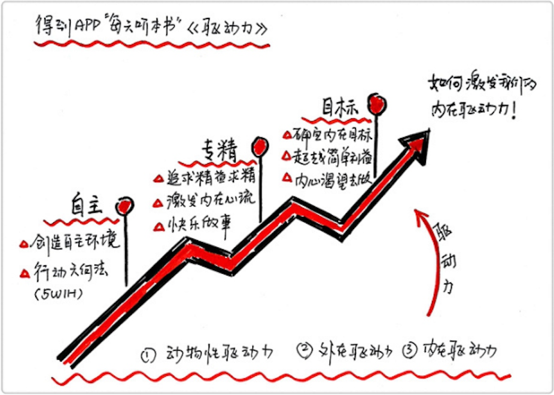

#
作者:  [美] 丹尼尔·平克
出版社: 中国人民大学出版社
副标题: 在奖励与惩罚都已失效的当下 如何焕发人的热情
原作名: Drive: The Surprising Truth about What Motivates Us
出版年: 2012-2
***
### 内容简介 
《驱动力》是趋势专家、畅销书作者丹尼尔•平克的最新著作。在书中，作者详细阐释了在奖励与惩罚都已失效的当下，如何焕发人们的热情，是对当前传统有关人类积极性理论的颠覆之作。

过去我们大部分人都遵循着如下的行为模式：老板答应我们加薪，我们的工作就格外卖力；用功可望拿到好分数，我们就花更多时间读书；迟到要扣薪水，我们就乖乖准时上班……本书将告诉你一个令人惊讶的真相：是什么在激励着你？

丹尼尔•平克以40年来有关人类激励的研究为基础，揭示了胡萝卜大棒这样的外部激励措施已不是激励我们自己和其他人的最好方法。在书中，他审视了驱动力的三大要素：自主、专精和目的。在每章的结尾处，还提供了实用的工具箱。

通过大量真实案例和科学研究成果，作者丹尼尔•平克为每个人、每个组织指出了**在胡萝卜大棒失效的时代如何提高绩效、焕发热情的三大要素：自主、专精和目的。**

### 作者简介 
趋势专家、《全新思维》作者，畅销书作家，《纽约时报》、《哈佛商业评论》、《快公司》和《连线》杂志撰稿人，美国前副总统戈尔及白宫行政部门演讲稿撰写人。

在世界各大公司、大学院校及各种协会进行演讲，讨论有关经济变革和创造新型工作环境的话题。

畅销书作者，主要著作有：《全新思维》《自由工作者的国度》《菜鸟职场物语》《未来在等待的人才》。

***
### 本书要点
#### PART 1 调动积极性的传统方法
传统模式：萝卜加大棒---奖罚分明
如果想要激励一个人，要么给出外部激励，要么给出外部惩罚。
适用范围有限：只适用于简单的机械重复劳动。在涉及到知识、创造和全身心投入事情的时候，往往不起作用，甚至会消磨积极性。

#### PART 2 什么是第三种驱动力
第一种驱动力：来自基本生存需要的生物性驱动
第二种驱动力：来自外在动力，即萝卜加大棒
第三种驱动力：来自内在的动力，内心把一件事情做好的欲望

#### PART 3 如何发挥第三种驱动力
自主、专精、目标
#####自主
自主的内在驱动力认为：人是会愿意为自己喜欢的任何事情去负责的。
传统的激励方式认为，如果给了人自由以后，他会不负责，他会逃避、偷懒、钻漏洞。事实上，人拥有了更多自主性，会激发更大的创造力。
实现的方式：能够自己决定做什么，什么时候做，怎么做，和谁做。
#####专精
专精的内在驱动力认为：有把事情做得越来越好的欲望。
实现的方式：创造心流的体验才能激发专精。一是任务既不能太难又不能太简单；二是把工作变成玩乐。
#####目标
目标的内在驱动力认为：光制定目标还不够，还得是制定正确的目标。人真正要建立的是超越个人利益的渴望和目标，渴望做出内心想做的事情。
外在目标：荣华富贵、功成名就，以利益为导向
内在目标：愿意帮助改善别人的生活，愿意让人更好地去成长
两种思考模式：
如果...那么... & 既然...那么...

***
### 感悟启发
在知道萝卜加大棒方式的时候，就隐约觉得它是由弊端的，就像金钱是由腐蚀作用的一样，萝卜加大棒也是。那么主导自己前行的动力到底是什么？《驱动力》一书给了我答案---内驱力。
每个人都有一个马达，只是有些人让它熄火了，而另一些则一直让马达开着。书中提供了许多工具箱，意在让马达保持动力，源源不断地提供能量。
作为一本工具书，值得一读。

### 拓展阅读
***
### 目录
引言 科学向左，企业向右
#####第一部分 驱动力3.0 时代来临
第1章 我们需要一次全面的升级
*驱动力洞察 我们放弃了原本收入不菲的职位，反而接受一份收入低、但使命感更强的工作；没有人“管理”维基百科的员工，但维基百科却是全世界最大的百科全书；还有开源产品、很多无法想象的“不为利润而来”的企业………奖励只能带来短期的爆发，就像是少量咖啡因只不过是帮你多撑了几个小时，更糟糕的是，它还降低了人们继续这项工作所需的长期积极性。*

第2章 奖励的惩罚，胡萝卜大棒失效了
*驱动力洞察 奖励有时候很奇怪，它好像是对人的行为施了魔法：把有意思的工作变成苦工，把游戏变成工作。胡萝卜大棒让我们希望得到的越来越少，不希望得到的越来越多：本来是要提高积极性却降低了积极性；本来是要激发创造力却抑制了创造力；本来是要让好人好事越来越多但实际上却让好人好事越来越少。上瘾者想要快速解决问题，置最终损害于不顾；撒谎者想要快速出奇制胜，置长远结果于不顾。*
I型工具箱：驱动力3.0与报酬

第3章 做 I 型人还是 X 型人
*驱动力洞察 如果你相信“大众皆平庸”，那么平庸就会成为无法逾越的天花板。你需要倾听内心的声音，你的能量之源来自外在动机还是内在动机？自由、挑战与担当是你的主要动机吗？你是更多关注行为带来的外在奖励，还是更多关注行为内在的成就感？我们究竟应该用哪种方式来思考人类行为的驱动力。*
I型工具箱：驱动力3.0与个人

#####第二部分 驱动力3.0的三大要素
第4章 自主：我做什么，我决定
*驱动力洞察 为什么一个迸发自由和创意的24小时被称做“联邦快递日”？为什么谷歌每年的新产品中竟有一半是在20%的完全自主时间内诞生的？这个时代不需要更好的管理，而需要自我管理的复兴。我们天生就是玩家，而不是小兵；我们天生就是自主的个体，而不是机器人。*
I型工具箱：驱动力3.0与教育

第5章 专精：把想做的事情做得越来越好
*驱动力洞察 在办公室里，我们服从太多，投入太少。前者让我们能够撑过白天，后者却让我们能够撑过晚上。控制带来的是服从，自主带来的则是投入。你是不是处于最兴奋、最令人满意的心流体验之中？达到心流，不仅仅是一瞬间的事情，而且应该被作为生活规范：为了实现专精而保持美丽的“聚精会神的神情”。 它是必需品，我们需要它才能存活，它是我们灵魂的氧气。*
I型工具箱：驱动力3.0与企业

第6章 目的：超越自身的渴望
*驱动力洞察 你是不是常听到“效率”、“利益”、“价值”、“优势”、“焦点”、“差异”这样的词语，这些目标很重要，但它们缺乏唤醒人类心灵的能力。我们常常以利润最大化为中心，而驱动力3.0在不拒绝利润的同时，强调的是目的最大化：如果一个人感觉不到自己属于更伟大更长久的事物，他就无法过上真正出色的生活。寻找目的是我们的天性，我们在复兴属于我们的商业，重塑我们的世界……*
I型工具箱：驱动力3.0与沟通
