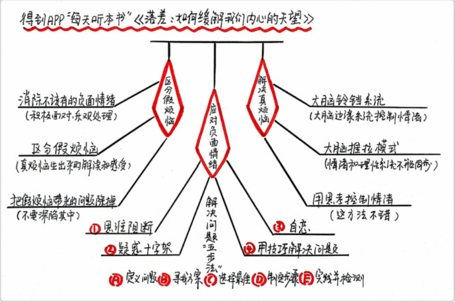

#[落差](https://book.douban.com/subject/26879144/)
作者: [法] 米歇尔·勒朱瓦耶
出版社: 江苏凤凰文艺出版社
副标题: 如何化解我们内心的失望
出版年: 2016-10
***
### 内容简介 
白宫“总统心理健康委员会”指定心理读物。本书系白宫“总统心理健康委员会”重要成员、国际著名精神分析学家米歇尔重磅作品。揭秘心理落差的危害与应对技巧，告诉我们，面对失望的打击，该如何及时化解内心的愤怒、悲伤、压抑和焦虑，停止情绪自虐，预防感染抑郁症，重拾对别人、对自己、对 生活的热情。

工作不顺心，感情不顺利，对最好的亲友失望至极……你曾不止一次感到失望——对生活，对别人，对自己。失望的感觉有浅有深，有时转瞬即逝，有时却延绵不绝，如同黑云一般裹住你的内心，使你抑郁无助，愤怒迷茫，内心失去秩序，隐隐不安。

在失望的背后隐藏着的，是一股愤懑的心理能量。这股 能量杀伤力极大，向外，攻击别人，向内，攻击自己。

通过这本书，你将得到许多不同的思维方式，并学会许多精彩的心理学技巧。你将随着这些文字，到你的内心深处走一遍，看清心中负面情绪的本质。你将一步步打破失望在你心中堆起的壁垒，唤醒真实的自己，重拾内心的勇气和活力，不再抑郁无力。

**请相信，这世上，凡是能让你失望的，都是你需要学会面对和超越的。唯有化解并超越心中的失望，才能活出平和而强大的自己。**

### 作者简介 
白宫“总统心理健康委员会”重要成员、巴黎七大精神分析学家之一，在比沙医院及白宫任心理治疗师。参与过百余次国内及国际心理项目研究，其内容主要涉及人类日常行为的社会、心理及生物学决定因素。著有《让个性、工作、爱情、头脑变得更好》等畅销作品。

***
.### 本书要点
第一、绝大多数的负面情绪都来自于假烦恼；
第二、了解大脑的工作原理；
第三、化解负面情绪的技巧

#### PART 1 绝大多数的负面情绪都来自于假烦恼
1、负面情绪不一定都带来烦恼
面对负面情绪，有的人却能不受负面情绪的影响，甚至反而能够将其转化为灵感。比如有些诗人、作家。
但是绝大多数人做不到的原因在于，陷入了由负面情绪带来的“假烦恼”。

2、区分真假烦恼
真烦恼：客观事实存在的烦恼，也就是正在面临的问题所直接带来的烦恼。
假烦恼：在真烦恼的问题发生之后，我们内心对此又产生新的解读和感受，而进一步带来的烦恼。
战胜负面情绪的第一步，首先要消除那些原本就不应该存在的负面情绪，那就是区分真假烦恼，先把由假烦恼带来的问题消灭掉。

#### PART 2 化解负面情绪，首先要了解大脑的工作原理
1、大脑的铃铛模式
对大脑的最新研究发现，大脑中间有一个小球，会向各个方向摇动，就像是铃铛内部的小锤，所以看起来大脑就像一个铃铛一样。这个小球部分，在医学上或解剖学上称为脑部扁桃体或大脑边缘系统。
情绪脑：主要受大脑边缘系统控制，负责正面和负面的情绪。
理性脑：主要在大脑新皮层区域，负责理性思考、推理分析。

2、大脑的“推拉系统”
大脑负责情绪和负责理性的这两部分区域，是不能同时工作。感动的时候就会失去理智，思考的时候会不动感情，生物学家把这种现象称作为大脑的“推拉系统”。
所谓推：即大脑把情绪往内推，让大脑边缘系统的“情绪脑”起作用，会让我们容易感动。
所谓拉：即大脑将感受、事件等拉到大脑新皮层区域，让“理性脑”起作用，让我们思考，从而让“情绪脑”平静下来。

3、正向利用和反向利用
利用大脑的运作模式，情绪控制可分为正向利用和反向利用。
正向利用：在需要进行美好情绪体验的时候，不去想任何需要调动理性逻辑分析的事情。比如在听话剧、看电影或欣赏一幅绘画名作的时候。
反向利用：在情绪化的时候，让自己理性思考，或处理一些需要调用逻辑能力的事情，那么就能够更好地控制自己的负面情绪。

#### PART 3 化解负面情绪的技巧和需要改变的思维方式
作者提供了很多武器工具和方法，在本期节目介绍了其中的四个小工具：
1、用思维阻断，打破惯性思维
事情和坏情绪之间不一定有必然联系，负面情绪的产生其实是惯性思维导致的。
要应对负面情绪，就要打破由负面情绪带来的思维定势，去建立新的正面的情绪连接。
之前节目叫《抗压力》，当中也讲了一个类似的方法叫“思维定势犬”。

2、用“疑惑十字符”，多角度思考
陷入到负面的情绪时，会放大自己的缺点或者事情的严重性，而不能很客观、全面地看待问题。比如：非常典型的现象“房间里的大象”
疑惑十字符：是一个四象限，在横轴的右端，是指生活中的成功，在横轴的左端，是指生活中的失败，而纵轴的上端是指有很多缺点和错误，纵轴的底部，指没有任何缺点和错误。
疑惑十字符告诉我们，生活不是只有一个维度，事情是由各种多元的因素决定的，要跳出由负面情绪带来自我解读，就要运用这种多角度更客观的视野，去全面的理解事实的真相。

3、寻找健康积极的自恋情绪
多试着去寻找自己的优点，多肯定自己，会带来积极的心理状态，对化解负面情绪有积极的意义。
比如：爱自拍的人比较容易从负面情绪中走出来。

4、解决问题的五步法
通过思考问题的五个处理步骤，能够帮助我们从负面情绪中走出来。
1. 定义问题
2. 寻找尽可能多的解决方案
3. 找出最可行的方案
4. 制定可执行的步骤
5. 付诸实践并检测效果

***
### 感悟启发
这本书是从认知角度上分析情绪和理性的原理，在听这本书的过程中，我想到的如下几点：为什么情绪上来的时候，需要告诉自己数数，来缓解情绪；为什么面对问题，面对烦恼，直接开始着手处理比空想更有效；为什么行动派是一种能量等等。在这本书里，能找到对应的原理。

### 拓展阅读
***
### 目录
第一章 心理落差：正视内心悄悄威胁着心理健康的失落感
第二章 自我保护：找到大脑中理智与感情的平衡点
第三章 告别轻抑郁的生活方式：如何经营生活，管理精力
第四章 拒绝坏情绪的思维模式：如何化解我们内心的失望